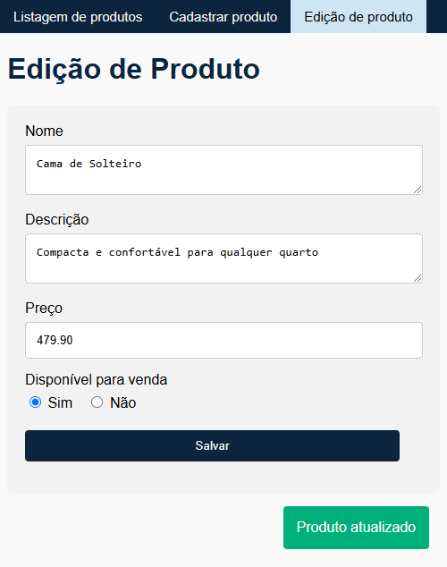

# Descrição do projeto

Esse projeto é um CRUD com arquitetura MVC.

- A página de listagem ordena os produtos por preço ascendentemente,
  e cada registro pode ser editado ou deletado.

- Ao clicar em uma linha, a descrição do respectivo produto é exibida.

  

- Os dados inseridos são validados na criação e atualização de produtos:
  <table>
    <tr>
      <td>
      
      </td>
      <td>
      
      </td>
    </tr>
  </table>

- Ao atualizar ou cadastrar, uma notificação é exibida
  no canto inferior direito da tela por alguns segundos:
    <table>
      <tr>
        <td>
        
        </td>
        <td>
        
        </td>
      </tr>
    </table>

- O usuário é redirecionado para a página de listagem quando um produto é cadastrado.
  Para que o usuário possa verificar as informações salvas, o redirecionamento não ocorre em
  atualizações de produto.

# Stack

- Java 17;
- Spring Web para lidar com as requisições e o padrão MVC;
- Spring Data com banco de dados em memória H2 para o armazenamento de dados, pela facilidade e
  praticidade em situações de teste e demonstração;
- Spring Validation para fazer a validação dos dados enviados pelo formulário da página de cadastro
  de produtos;
- Spring Boot Test para fazer
  os [testes de integração](src/test/java/com/alexandrerocha/product/ProductControllerIntegrationTest.java);
- Thymeleaf para fazer os [templates HTML](src/main/resources/templates) da página de cadastro e
  listagem de produtos.

# Decisões de arquitetura e projeto

- Pela natureza demonstrativa do projeto, eu não criei perfis de desenvolvimento diferentes
  (produção e teste);
- O banco de dados persiste as entidades apenas durante a execução do programa.
  Entretanto, o script [data.sql](src/main/resources/data.sql) inicializa o BD com
  alguns registros para ser possível a visualização da listagem dos produtos logo ao iniciar a
  aplicação;
- DTOs são utilizados validar os dados fornecidos pelo usuário, bem como para não retornar a
  entidade de persistência;

# Como eu aprimoraria a partir daqui

- Cache, pois, atualmente, o banco de dados é consultado em cada requisição feita na página
  de listagem, ainda que nenhum produto tenha sido adicionado;
- Paginação e ordenação por coluna na página de listagem.

