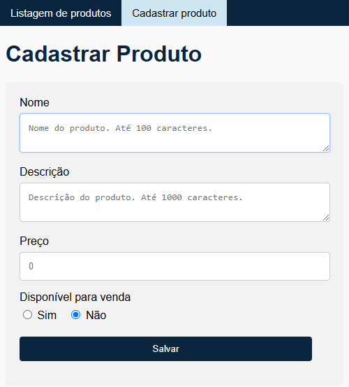

# Descrição do projeto

Para esse desafio eu utilizei Java 17 e os frameworks:

- Spring Web para lidar com as requisições e o padrão MVC;
- Spring Data com banco de dados em memória H2 para o armazenamento de dados, pela facilidade e
  praticidade em situações de teste e demonstração;
- Spring Validation para fazer a validação dos dados enviados pelo formulário da página de cadastro
  de produtos;
- Spring Boot Test para fazer
  os [testes de integração](src/test/java/com/alexandrerocha/product/ProductControllerIntegrationTest.java);
- Thymeleaf para fazer os [templates HTML](src/main/resources/templates) da página de cadastro e
  listagem de produtos.

# Decisões de arquitetura e projeto

- Pela simplicidade do projeto, não criei perfis de desenvolvimento diferentes (produção e
  teste);
- O banco de dados persiste as entidades temporariamente, durante a execução do programa.
  Entretanto, o script [data.sql](src/main/resources/data.sql) inicializa o banco de dados com
  alguns registros para ser possível a visualização da listagem dos produtos logo ao iniciar a
  aplicação;
- Devido à simplicidade da lógica de negócio, não criei uma camada de serviço para lidar com a
  lógica e armazenamento no banco de dados;
- DTOs foram utilizados validar os dados fornecidos pelo usuário, bem como para não retornar a
  entidade de persistência;
- As URIs foram nomeadas seguindo convenções do estilo REST.

# Funcionalidades

- Páginas de cadastro e de listagem de produtos;
- O cadastro do produto solicita os dados: nome, descrição, valor e a disponibilidade para venda;
- Ao cadastrar um produto, o usuário é redirecionado para a página de listagem;
- A listagem contém uma tabela com duas colunas, nome e valor, e é ordenada por valor de maneira
  ascendente. A página também possui um botão para cadastrar um novo produto, redirecionando o
  usuário para a página de cadastro de produtos.

<table>
  <tr>
    <td>
    
    </td>
    <td>
    
    </td>
    <td>
    
    </td>
  </tr>
</table>

# Como eu aprimoraria a partir daqui

Adicionaria as funcionalidades de:

- Cache, pois, atualmente, o banco de dados é consultado em cada requisição feita na página
  de listagem, ainda que nenhum produto tenha sido adicionado;
- Paginação e ordenação por coluna na página de listagem;
- Atualização e deleção de produtos;
- Expansão da tabela de listagem de produtos para exibir mais informações.

