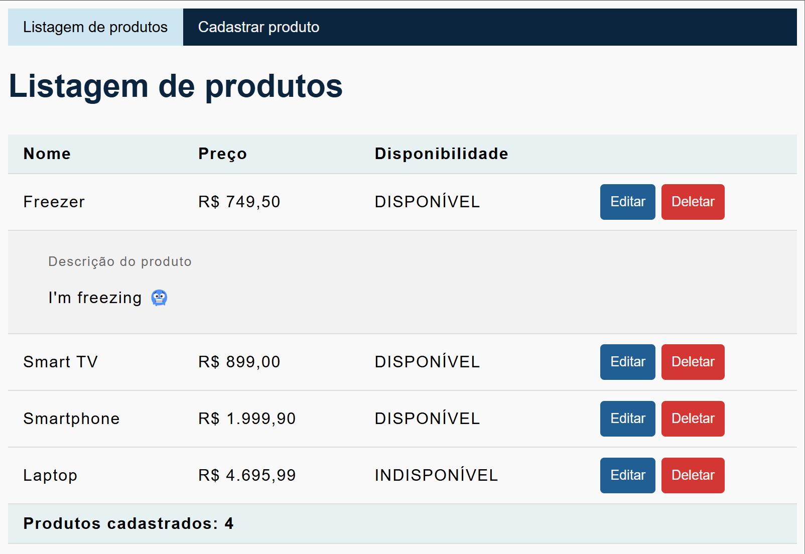

# Descrição do projeto

Esse projeto é um CRUD com arquitetura MVC.

- A página de listagem de produtos é paginada e, por padrão, ordenada por ID em ordem decrescente, para que cadastros mais recentes apareçam no topo.

    

- A ordenação e a respectiva direção são alteradas clicando no cabeçalho da coluna (imagem abaixo).
- A descrição de um produto pode ser visualizada ao clicar em sua linha.

  

- Os dados inseridos são validados na criação e atualização de produtos:
  
    
  
- Ao cadastrar um produto, o usuário é redirecionado para a página de listagem. O redirecionamento não ocorre em atualizações para facilitar uma eventual alteração consecutiva após salvar, uma vez que a ordenação padrão é por ordem de criação e não de alteração.

- Ao atualizar ou cadastrar, uma notificação é exibida
  no canto inferior direito da tela por alguns segundos:

    

- A quantidade de registros exibidos simultaneamente pode ser alterada utilizando o seletor no canto superior direito da tabela:

  

- Ao clicar em "Deletar", o usuário recebe um alerta para confirmar a ação:

  

# Stack

- Java 17;
- Spring Web para lidar com as requisições e o padrão MVC;
- Spring Data com banco de dados em memória H2 para o armazenamento de dados, pela facilidade e praticidade em situações de teste e demonstração;
- Spring Validation para fazer a validação dos dados enviados pelo formulário da página de cadastro de produtos;
- Spring Boot Test para fazer os [testes de integração](src/test/java/com/alexandrerocha/product/ProductControllerIntegrationTest.java);
- Thymeleaf para fazer os [templates HTML](src/main/resources/templates) da página de cadastro e listagem de produtos.

# Decisões de arquitetura e projeto

- Pela natureza demonstrativa do projeto, eu não criei perfis de desenvolvimento diferentes
  (produção e teste);
- O banco de dados persiste as entidades apenas durante a execução do programa.
  Entretanto, o script [data.sql](src/main/resources/data.sql) inicializa o BD com alguns registros para ser possível a visualização da listagem dos produtos logo ao iniciar a aplicação;
- DTOs são utilizados validar os dados fornecidos pelo usuário, bem como para não retornar a entidade de persistência.